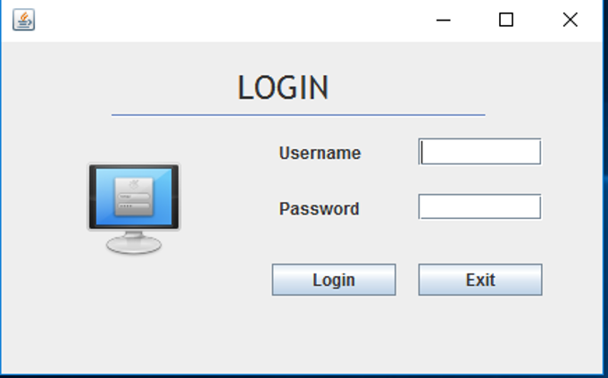
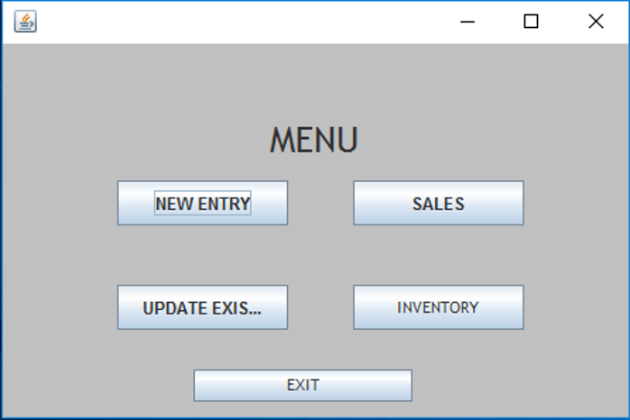
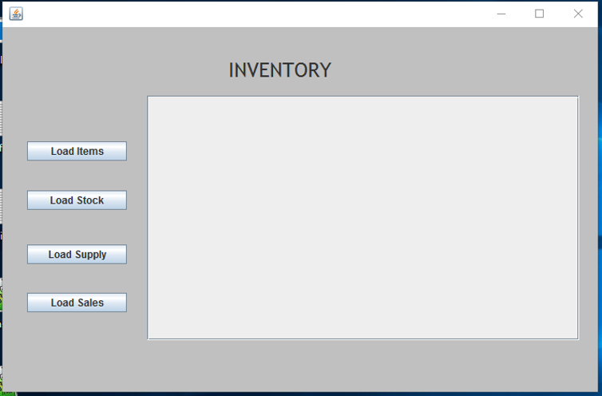
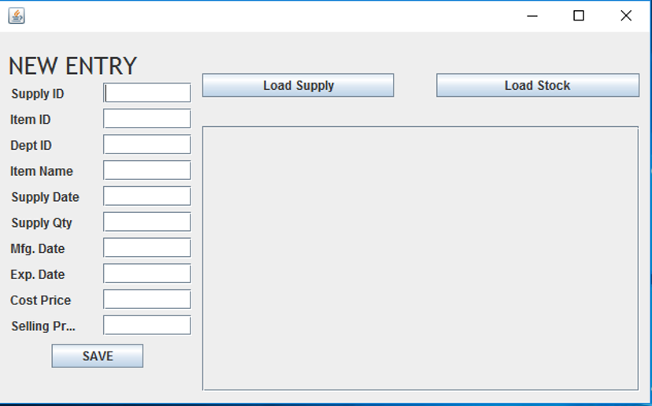

# Store-Management-System
A simple database system using PL/SQL and Java Swings for a departmental store which allows the shopkeeper to keep a track of the sales and inventory in his/her shop.

table.sql contains the DDL commands to create all the tables.
insert.sql contains the value that is to be inserted into these tables and all the PL/SQL blocks and trigger codes.

LOGIN PAGE

MAIN MENU

INVENTORY PAGE

SUPPLY PAGE

